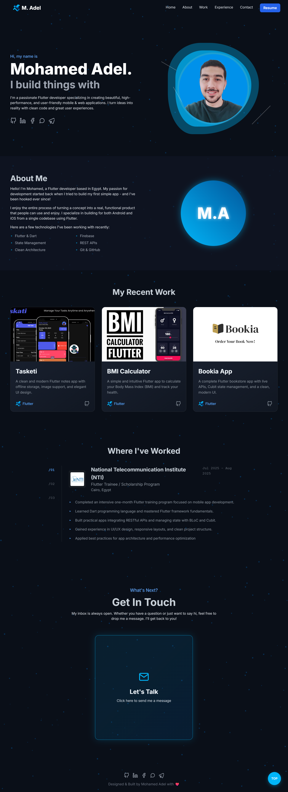

# Flutter Developer Portfolio

[

**[🚀 View Live Demo](https://modola0100.github.io/-Portfolio/)**
*(Note: Replace the URL with your actual GitHub Pages link)*

---

## 📖 About This Project

This is my personal developer portfolio, designed to showcase my skills, projects, and experience as a Flutter Developer. It is built as a clean, modern, single-page application (SPA) using **vanilla HTML, Tailwind CSS, and modular JavaScript (ES6)**.

The project emphasizes a clean UI/UX, subtle micro-interactions, and a clear separation of concerns by splitting each logical section into its own self-contained JavaScript module.

---

## ✨ Key Features

This portfolio is packed with modern web features to create an engaging user experience:

* **🎨 Fully Responsive Design:** Looks and works great on all devices, from mobile phones to desktops.
* **🌌 Interactive Particle Background:** A dynamic `HTML5 Canvas` particle background that subtly animates and interacts with the user's mouse (repulsion effect).
* **🌟 Scroll Animations:** Elements fade and slide into view as you scroll, powered by the `ScrollReveal.js` library.
* **✍️ Dynamic Typing Effect:** A "typing" animation in the hero section cycles through key skills.
* **🎠 Project Carousel:** A touch-friendly, autoplaying project slider built with `Swiper.js`.
* **🔍 Project Detail Modal:** A clean modal pops up to display detailed information, images, and links for each project.
* **🗂️ Interactive Experience Tabs:** A tabbing system to cleanly organize and display work history.
* **🔄 3D Flipping Contact Card:** A 3D card in the contact section that flips on hover to reveal the contact form.
* **📬 AJAX Contact Form:** The Formspree contact form is submitted via JavaScript's `fetch` API without a page reload, providing instant validation and success messages.
* **✒️ Animated Form Inputs:** Modern, Material Design-inspired form fields with an animated underline on focus.

---

## 🛠️ Tech Stack & Libraries

* **Core:** HTML5, CSS3, JavaScript (ES6 Modules)
* **Styling:** Tailwind CSS (via CDN)
* **Animations:** `ScrollReveal.js`, `Swiper.js`
* **Backend (Contact Form):** [Formspree](https://formspree.io/)

---

## 📂 Project Structure

The project uses a modular, feature-based directory structure to keep the code organized and maintainable.

```
/portfolio-project
├── index.html
├── README.md
└── src/
    ├── assets/
    │   ├── css/
    │   │   └── global.css
    │   ├── images/
    │   │   ├── 4.png
    │   │   └── 100.jpg
    │   └── resume/
    │       └── Mohamed_Adel_Resume.pdf
    │
    ├── features/
    │   ├── 1-hero/
    │   │   └── hero.js
    │   ├── 2-work/
    │   │   ├── work.css
    │   │   └── work.js
    │   ├── 3-experience/
    │   │   └── experience.js
    │   └── 4-contact/
    │       ├── contact.css
    │       └── contact.js
    │
    └── shared/
        ├── app.js       (Main JS entry point)
        └── ui/
            ├── animations.js
            ├── particles.js
            └── ui.js      (General UI elements like header, mobile menu)
```

---

## 🚀 Getting Started

To run this project locally:

1.  **Clone the repository:**
    ```sh
    git clone [https://github.com/modola0100/portfolio.git](https://github.com/modola0100/portfolio.git)
    ```

2.  **Navigate to the project directory:**
    ```sh
    cd portfolio
    ```

3.  **Open `index.html` in your browser.**
    * For the best experience (to avoid CORS errors with module imports), it's recommended to use a simple local server, like the [Live Server](https://marketplace.visualstudio.com/items?itemName=ritwickdey.LiveServer) extension in VS Code.

---

## 👨‍💻 Author

* **Mohamed Adel**
* **GitHub:** [@modola0100](https://github.com/modola0100)
* **LinkedIn:** [mohamed-adel-051ba4256](https://www.linkedin.com/in/mohamed-adel-051ba4256)

---

## 🙏 Acknowledgements

* Design and branding inspired by the **Flutter Framework**.
* Libraries: [Swiper.js](https://swiperjs.com/) & [ScrollReveal.js](https://scrollrevealjs.org/).
